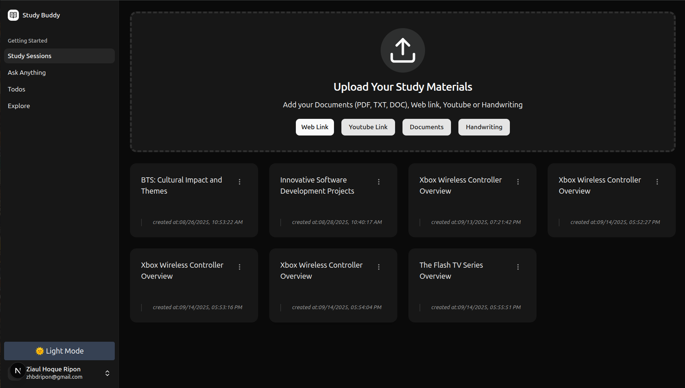
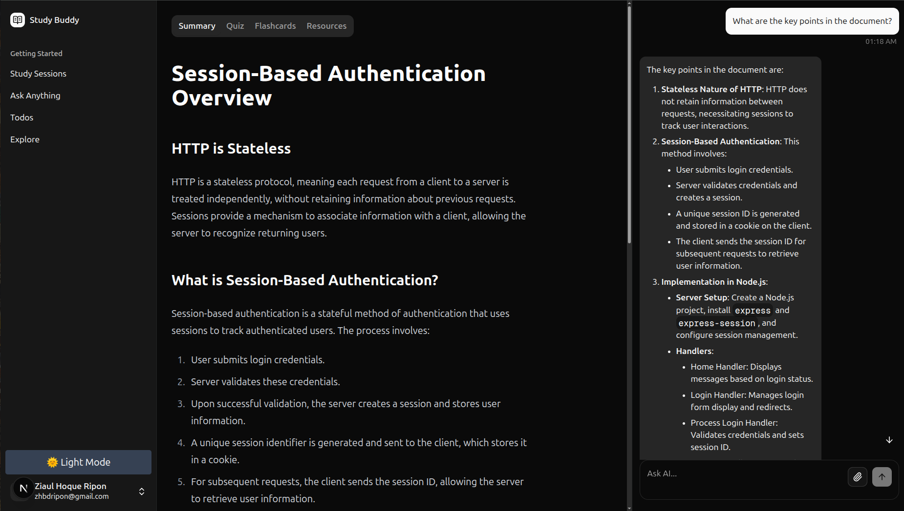

# Studybuddy




Studybuddy is a generative AI-based study platform designed for students. It enables users to upload and interact with documents, web URLs, YouTube links, and plain text. The platform leverages advanced AI to provide document summarization, AI-powered chat, MCQ quizzes, flashcards, and more to enhance the learning experience.

## Features

- **Document Upload:** Upload PDFs, web URLs, YouTube links, or plain text as study materials.
- **AI Summarization:** Get concise summaries of your documents using state-of-the-art AI models.
- **Document Chat:** Chat with your documents using generative AI to ask questions and get instant answers.
- **MCQ Generation:** Automatically generate and take multiple-choice quizzes based on your study materials.
- **Flashcards:** Create and review flashcards for effective memorization.
- **User Authentication:** Secure login with Google OAuth and session management.
- **Progress Tracking:** Track your quiz and flashcard performance.

## Tech Stack

- **Next.js** (App Router, React 19)
- **Drizzle ORM** (PostgreSQL)
- **LangChain** (AI orchestration)
- **OpenAI API** (LLM and embeddings)
- **Pinecone** (Vector database)
- **Radix UI, Tailwind CSS** (UI components)
- **Zod** (Validation)

## Getting Started

### Prerequisites

- Node.js v18 or later
- PostgreSQL database

### 1. Clone the Repository

```bash
git clone https://github.com/zhbdripon/study-buddy.git
cd study-buddy
```

### 2. Install Dependencies

```bash
npm install
```

### 3. Configure Environment Variables

Create a `.env` file in the root directory and fill in the required values. Example:

```env
# DB
DATABASE_URL=postgresql://<user>:<password>@localhost:5432/study_buddy

# Auth
BETTER_AUTH_SECRET=your_auth_secret
BETTER_AUTH_URL=http://localhost:3000
GOOGLE_CLIENT_ID=your_google_client_id
GOOGLE_CLIENT_SECRET=your_google_client_secret

# OpenAI
OPENAI_API_KEY=your_openai_api_key
OPENAI_LOG=""

# LangChain
LANGCHAIN_TRACING_V2=true
LANGSMITH_PROJECT=langchain-js-demo
LANGSMITH_ENDPOINT="https://api.smith.langchain.com"
LANGSMITH_TRACING="true"
LANGSMITH_API_KEY=your_langsmith_api_key

# Pinecone
PINECONE_API_KEY=your_pinecone_api_key
PINECONE_INDEX=study-buddy
PINECONE_ENVIRONMENT=us-east-1
```

> **Note:** Replace all placeholder values with your actual credentials.

### 4. Database Setup

Generate and run database migrations:

```bash
npm run db:generate
npm run db:migrate
```

### 5. Start the Development Server

```bash
npm run dev
```

The app will be available at [http://localhost:3000](http://localhost:3000).

## Scripts

- `npm run dev` — Start the development server
- `npm run build` — Build the app for production
- `npm run start` — Start the production server
- `npm run db:generate` — Generate Drizzle ORM migrations
- `npm run db:migrate` — Run database migrations
- `npm run lint` — Lint the codebase

## License

This project is licensed under the MIT License.

---

**Studybuddy** — AI-powered learning for the next generation of students.

## setting up precommit hook

npm run prepare

<!-- https://dbdiagram.io/d/study_buddy_erd-686995cdf413ba350871e8f7 -->
